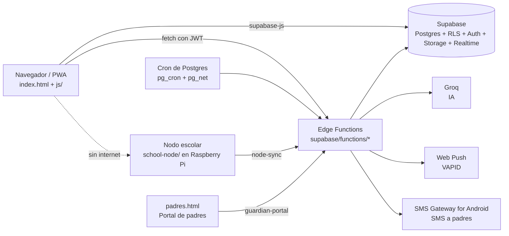

# Arquitectura de Quetzal LMS

Este documento explica cómo está armado el sistema para que una persona nueva
pueda ubicarse en el código en una tarde. Para instalarlo ver
[SETUP.md](SETUP.md); para colaborar, [CONTRIBUTING.md](../CONTRIBUTING.md).

## Vista general

| Capa | Dónde | Tecnología |
|---|---|---|
| Interfaz | `index.html`, `js/`, `css/` | JavaScript sin framework (módulos ES + funciones en `window`), Tailwind compilado |
| Modo sin conexión | `service-worker.js`, `js/offline-kit.js`, `js/sync-manager.js` | Service worker con caché, IndexedDB/localStorage |
| Base de datos y seguridad | Supabase (Postgres) | Reglas por fila (RLS), permisos por columna, funciones `SECURITY DEFINER` |
| Lógica de servidor | `supabase/functions/` (espejo en `supabase-functions/`) | Deno (Edge Functions) |
| Nodo escolar | `school-node/` | Node.js + better-sqlite3 en Raspberry Pi 4 |
| Portal de padres | `padres.html` | HTML autocontenido, sin librerías |
| Hosting | GitHub Pages | `clases.yoaprendo.online` y `billiog.github.io/proyectoX/` |

No hay paso de compilación para el JavaScript: lo que está en `js/` es lo que
se publica. El único paso de build es Tailwind (`css/tailwind.src.css` →
`css/tailwind.css`).

## Arranque de la aplicación

1. `index.html` carga Supabase, `js/config.js` (URL y clave pública) y `js/app.js`.
2. `app.js` importa los módulos base y llama a `initAuth()` (`js/auth.js`).
3. `initAuth()` decide el modo:
   - **Nodo escolar**: si la app se abrió desde una Raspberry (`detectQuetzalNode`), todo pasa a `js/node-mode.js`.
   - **Sesión en la nube**: `handleSuccessfulLogin()` carga el perfil desde `teachers` o `students` y fija el rol.
   - **Sin conexión**: usa las cuentas guardadas en la tablet (`js/offline-kit.js`).
4. `nav(vista)` (en `js/main.js`) muestra la sección y carga sus módulos bajo demanda con `loadModule()` según `MODULE_MAP`.

## Roles

| Rol | Tabla | Qué puede hacer |
|---|---|---|
| `admin` | `teachers.role = 'admin'` | Todo: escuelas, docentes, alumnos, reportes, avisos globales |
| `coordinador` | `teachers.role = 'coordinador'` | Ve a los docentes que el admin le asignó |
| `docente` | `teachers` | Sus clases (`teacher_assignments`): alumnos, asistencia, evaluación, cursos, avisos, padres |
| `estudiante` | `students` | Cursos, proyectos, Centro de Juego, perfil |
| Padre o encargado | `student_guardians` (sin cuenta) | Portal de padres con enlace personal |

El rol **siempre** se decide en el servidor con las tablas, nunca con datos que
manda el navegador.

## Módulos del cliente (`js/`)

### Base
| Archivo | Responsabilidad |
|---|---|
| `app.js` | Punto de entrada |
| `main.js` | Navegación, `MODULE_MAP` y carga perezosa de módulos |
| `config.js` | URL y clave pública de Supabase, grados, niveles, secciones |
| `auth.js` | Login, sesión, rol, cierre de sesión |
| `utils.js` | `sanitizeInput`, `fetchWithCache`, `fetchAllRows`, grados, toasts |
| `sync-manager.js` | Caché local y cola de cambios sin conexión |
| `offline-kit.js` | Varias cuentas por tablet, PIN, almacenamiento persistente |
| `node-mode.js` | Modo nodo escolar (API local de la Raspberry) |
| `notification-center.js` | Refresca los contadores (campana, evaluar, duelos) |
| `activity-tracker.js` | Tiempo activo (latido cada 30 s, calculado en servidor) |

### Aprendizaje
| Archivo | Responsabilidad |
|---|---|
| `lessons.js` | Cursos, recursos (PDF, video, H5P, SCORM, quiz), reproductor, progreso |
| `weekly-topic.js` | Tema de la semana y reporte de duelos para el docente |
| `projects.js`, `project-modals.js`, `feed-ui.js` | Proyectos de los alumnos y feed |
| `evaluation*.js` | Evaluación de proyectos con rúbrica e IA |
| `groups.js` | Equipos de proyecto |
| `attendance*.js` | Asistencia por QR |
| `ai-service.js` | Cliente de `ai-proxy` |
| `mascot-widget.js` | Asistente Quetzal (oculto en pantallas evaluativas) |

### Gamificación
| Archivo | Responsabilidad |
|---|---|
| `gamification.js` | Centro de Juego, cofre diario, gemas en vivo, guía de gemas |
| `game-arena.js` | Capa común de los juegos 1v1 (VS, resultados, retos rápidos, presencia) |
| `duels.js`, `hangman-duel.js`, `timed-math-duel.js`, `debug-duel.js`, `spelling-duel.js` | Los 5 juegos 1v1 |
| `companion.js` | Mascotas, Quetzadex, emotes, vestidor, tarjeta para redes, videos |
| `season-pass.js`, `leagues.js`, `tournaments.js`, `random-events.js` | Pase, ligas, torneos, eventos sorpresa |
| `badges.js`, `ranking.js`, `certificates.js` | Insignias, ranking, diplomas |

### Gestión
| Archivo | Responsabilidad |
|---|---|
| `students.js` | Alumnos, contraseñas de clase, alta por docentes, padres |
| `teachers.js`, `coordinator.js` | Docentes, asignaciones, coordinación |
| `schools.js`, `programs.js` | Establecimientos y programas |
| `pdf-processor.js` | Importación de nóminas del SIRE (PDF) |
| `announcements.js`, `surveys.js` | Avisos y encuestas |
| `admin-*.js`, `kpi-engine.js`, `bonus-system.js` | Tableros, reportes y bonos del admin |

## Funciones de servidor (`supabase/functions/`)

| Función | Qué hace | Autenticación |
|---|---|---|
| `admin-bulk-import-students` | Crea cuentas de alumnos (admin, o docente en sus clases) | JWT |
| `admin-create-teacher` | Crea docentes | JWT (admin) |
| `admin-delete-students` | Borra alumnos y sus cuentas | JWT (admin) |
| `admin-force-delete-school` | Borra un establecimiento completo | JWT (admin) |
| `admin-set-class-password` | Contraseña compartida de una clase | JWT |
| `ai-proxy` | Chat del asistente (modo tutor para alumnos) | JWT |
| `ai-generate-quiz` / `-hangman-word` / `-spelling-word` / `-debug-steps` | Contenido de los duelos, sin repetir por tema | JWT |
| `ai-evaluate-project`, `ai-evaluate-mblock`, `ai-generate-general-report` | IA para docentes y admin | JWT |
| `generate-team-match-quiz`, `submit-team-match-answer` | Torneos | JWT |
| `submit-event-answer` | Eventos sorpresa (puntaje en servidor) | JWT |
| `notify-duel`, `notify-announcement`, `notify-rock-pending` | Notificaciones push | JWT |
| `notify-guardians` | Envía avisos a padres (push o SMS) | JWT |
| `guardian-portal` | Backend del Portal de padres (token personal) | Sin JWT |
| `student-login` | Login de alumnos por usuario y clases sin contraseña | Sin JWT |
| `serve-scorm-entry` | Sirve paquetes SCORM/HTML5 con el tipo correcto | Sin JWT |
| `node-sync` | Sincroniza un nodo escolar (token del nodo) | Sin JWT |
| `trigger-random-event`, `settle-random-event`, `notify-inactive-users` | Tareas programadas (secreto `CRON_SECRET`) | Sin JWT |

Cada función existe dos veces, idéntica, en `supabase/functions/<nombre>/` y
`supabase-functions/<nombre>/`. La CI falla si difieren.

## Seguridad: los patrones que se repiten

- **RLS en todas las tablas.** El navegador usa la clave pública; lo que ve cada usuario lo deciden las políticas.
- **Permisos por columna.** A `authenticated` se le revoca todo y se le devuelve solo una lista de columnas (ver `economy-server-side-fix2.sql`). Gemas, XP, racha y notas no se pueden escribir desde el navegador.
- **RPC `SECURITY DEFINER`** para toda acción con premio o dinero virtual: `claim_daily_chest`, `finish_student_duel`, `buy_cosmetic`, `buy_companion_egg`, etc. Siempre con `set search_path = public`.
- **Funciones de ayuda de permisos**: `is_admin()`, `is_staff()`, `can_manage_student()`, `can_see_announcement()`.
- **Service role solo en Edge Functions.** Nunca en el cliente ni en el repositorio.
- **Menores de edad**: nada de nombres completos en lo que se comparte fuera (tarjeta de mascota, portal de padres).
- **Fecha de Guatemala** (`America/Guatemala`) para rachas, cofres y topes diarios.

## Sin conexión

Hay tres niveles:

1. **Caché de la app** (`service-worker.js`): la aplicación abre sin internet. `CACHE_NAME` cambia en cada versión.
2. **Tablet sin internet** (`offline-kit.js`, `sync-manager.js`): cuentas guardadas con PIN, cursos descargados, cambios en cola hasta que vuelve la señal.
3. **Nodo escolar** (`school-node/`, `node-mode.js`): una Raspberry sirve la app y el contenido a toda la escuela por Wi-Fi local; sincroniza con `node-sync` cuando tiene señal. Ver `school-node/README.md`.

## Gamificación y economía

- **Gemas**: se ganan en duelos (apuesta del rival + premio de la arena con tope de 8 por día), cofre diario, retos, pase de temporada. Cada cambio queda en `student_gem_events` y se escucha en vivo por Realtime.
- **XP y ligas**: `league_weekly_points` por semana y escuela.
- **Mascotas**: la etapa sale de `gems_earned_total` (no baja al gastar). Colección en `student_companions`.
- **Contenido de duelos**: generado por IA en el servidor; el cliente nunca recibe la respuesta correcta antes de jugar.

## Notificaciones

| Canal | Cómo |
|---|---|
| Campana en la app | Tablas `announcements`, `comment_notifications`, retos pendientes |
| Push (web) | `push_subscriptions` + funciones `notify-*` con VAPID |
| Padres | `student_guardians` → cola `guardian_notifications` → `notify-guardians` (push si activaron el portal, si no SMS) |
| Correo | `notify-inactive-users` con Resend |
